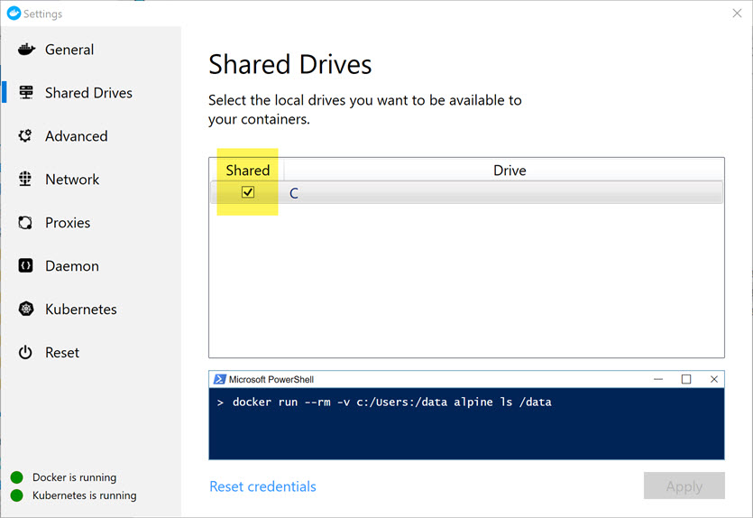

 ➕
Your local disks = ✅
# This Notebook will walk you through how to allow Docker to access storage on your local [Windows] machine.

In order to complete the external storage demos, you will need to grant Docker the ability to access your local drive.  In my case, I did this by granting Docker access to one single directory, and all of it's sub-directories.

